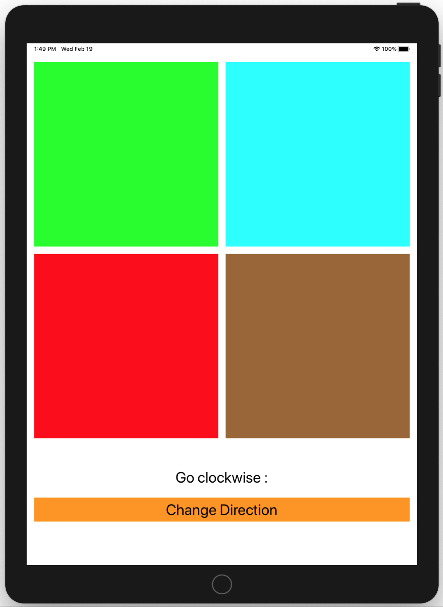
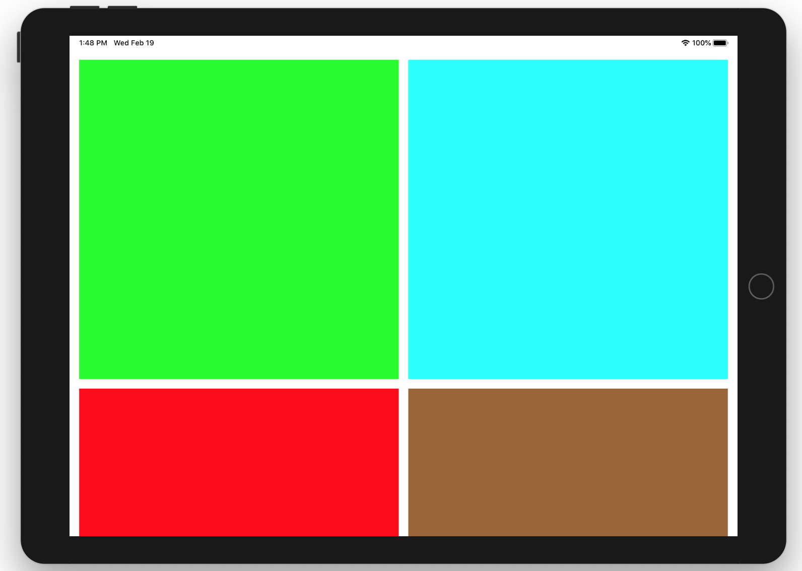
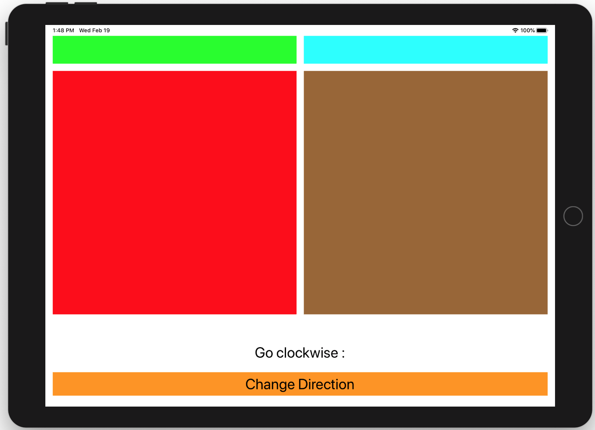

# Auto Layout challenge

This is an Auto Layout challenge for students of iOS development.

**ColoredButtons** is a mini-app that changes the colors of squares on the screen according to the direction chosen: clockwise or counterclockwise. 

For this exercise, the code is ready and the UI has all required elements, but views are not correctly placed, plus they need to look good on all devices and orientations.

Our design requirements are:

* each colored button must be a square, i.e. the width and height must be equal
* the squares must be placed in a grid-like distribution, so as to keep the locations "top left", "top right", "bottom left" and "bottom right"
* all squares must be of the same size
* there must be a spacing between the screen edges to the squares of 16 points
* there must be a spacing of 16 points betwen the squares, both in the vertical and horizontal directions
* the squares must expand to accomodate to larger screens, i.e. the actual size of the squares must be dynamically calculated
* the direction label must be:
  * 64 points below the second row of squares, and
  * centered horizontally in the screen
* the change direction button must be:
  * 24 points below the direction label,
  * centered horizontally in the screen
  * at least 24 points from the bottom of the screen, and
  * stretched horizontally to the width of the screen except for 16 points to either side
* all the UI elements must be accessible regardless of the device size and orientation

For instance, your design would look like this on an iPad Air simulator on portrait orientation.

For landscape orientation, the UI should be able to scroll to accommodate all the content, like so:

## Extra challenge

* Can you solve it both with stack views and without?

